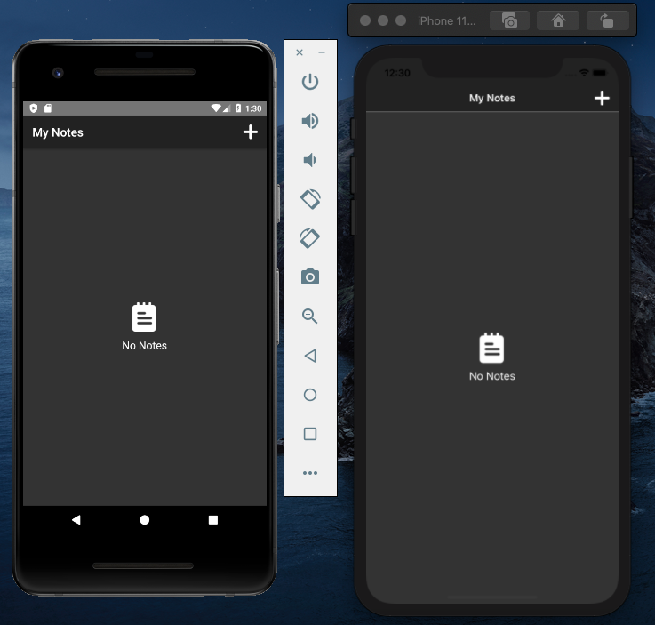
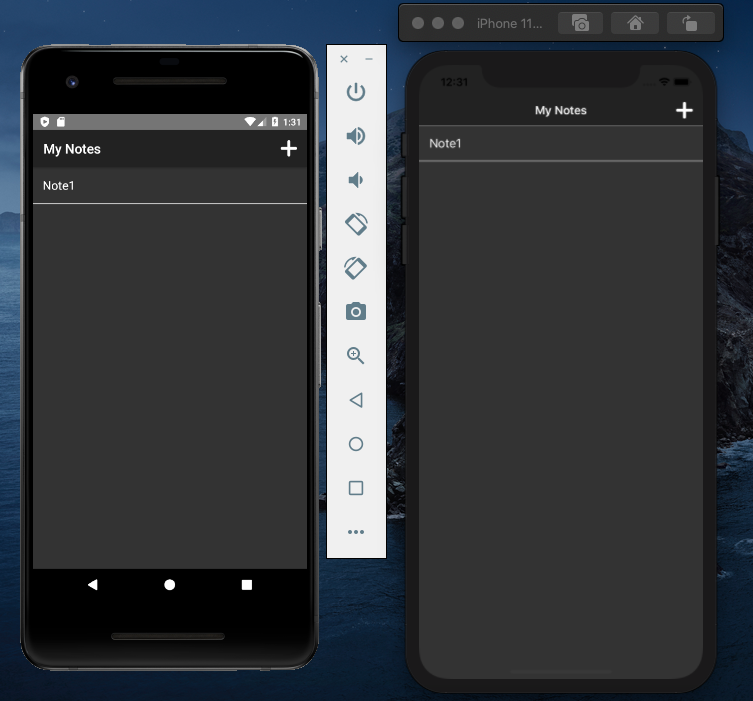
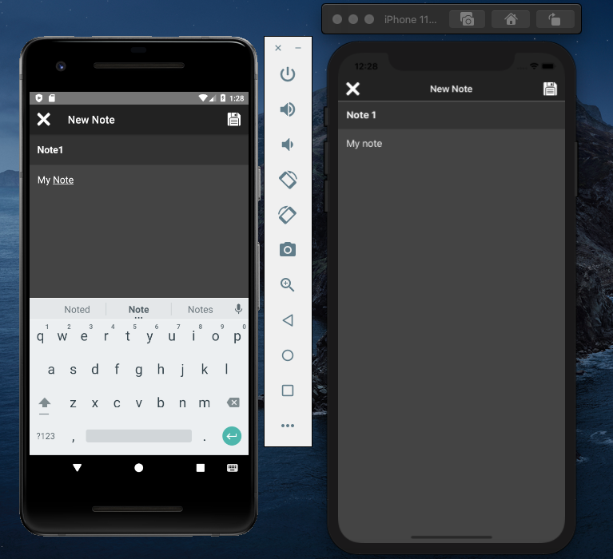
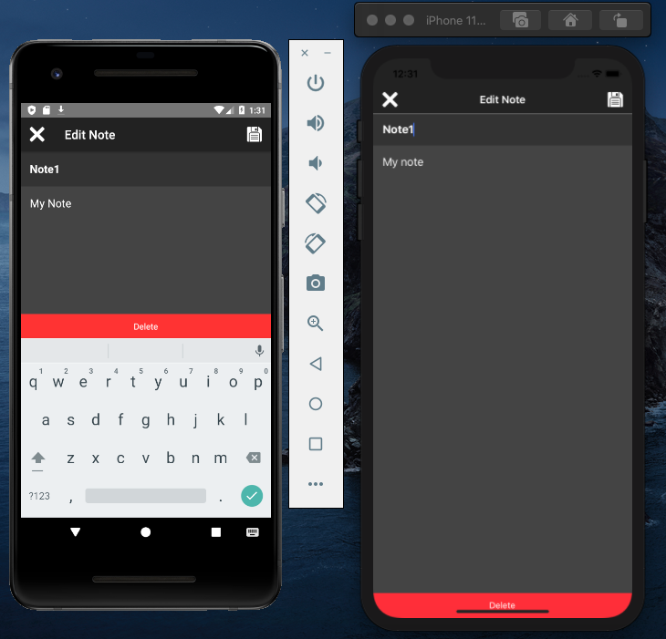

# My Notes App

Simple Notes App using React Native

# Installation

1- Clone the project

```
git clone https://github.com/mffernando/MyNotes.git
```

2- Run the project

IOS

```
npx pod-install
npx react-native run-ios
```

ANDROID

```
npx react-native run-android
```

# Screenshots

Main Empty Notes Screen

<p align="center">
  
</p>

Main Notes Screen

<p align="center">
  
</p>

Add New Note Screen

<p align="center">
  
</p>

Edit or Delete Note Screen

<p align="center">
  
</p>
